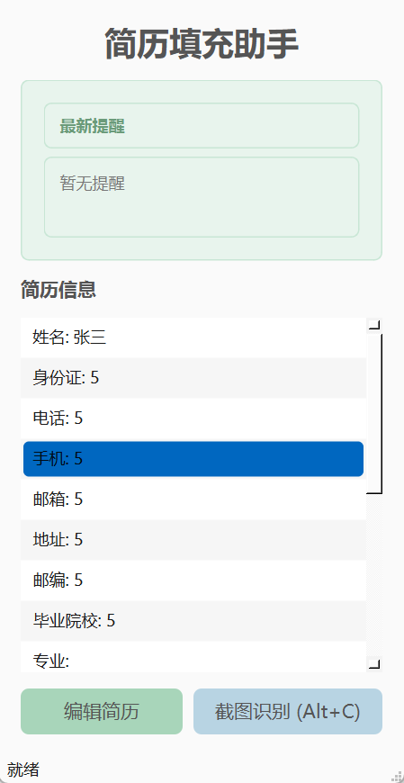
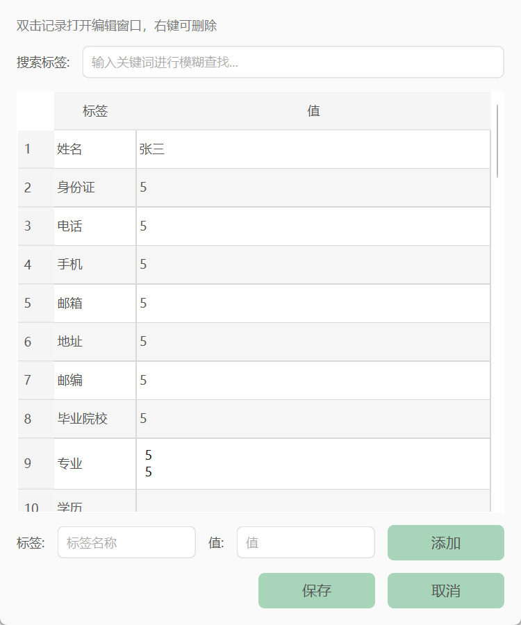
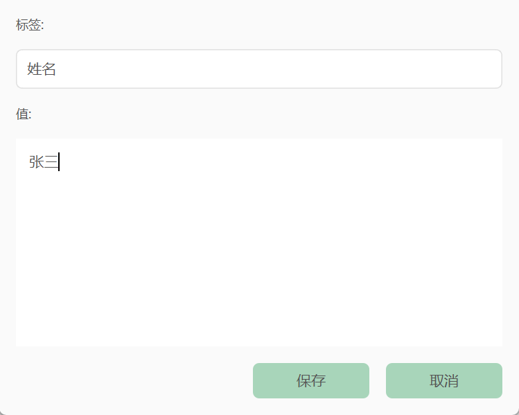

# 半自动简历填充助手

一个基于PySide6的GUI应用，通过OCR识别和智能匹配，快速填充简历信息到剪切板。

## 功能特性

- 📸 **快捷键截图**：按 `Alt+C` 调出截图窗口（类似微信截图）
- 🔍 **OCR文字识别**：使用RapidOCR（ONNX CPU模式）识别截图中的文字
- 🎯 **智能标签匹配**：使用编辑距离算法（50%阈值）匹配简历标签
- 📋 **自动复制**：匹配成功后自动复制到剪切板
- 💾 **YAML存储**：简历模板以YAML格式存储，易于编辑
- 🎨 **简洁界面**：手机比例窗口，置顶显示，操作直观
- 🔔 **Toast提醒**：屏幕中央和主窗口内显示最新操作提醒
- 📝 **简历管理**：支持添加、修改、删除简历字段

## 安装

使用uv管理环境：

```bash
uv sync
```

## 运行

```bash
uv run python src/main.py
```

## 使用说明

1. **首次使用**：点击"编辑简历"按钮，添加你的个人信息（姓名、身份证、电话等）

2. **截图识别**：
   - 按 `Alt+C` 或点击"截图识别"按钮
   - 在网页上选择要识别的标签区域（如"姓名"、"身份证"等）
   - 程序会自动识别文字并匹配简历模板
3. **自动填充**：
   - 如果只有一个匹配，自动复制到剪切板并显示Toast提醒
   - 如果有多个匹配，弹出选择窗口，选择后复制
4. **粘贴使用**：在网页表单中按 `Ctrl+V` 粘贴已复制的内容

## 预设标签

程序预设了以下常见标签类别：
- 姓名、身份证、电话、手机、邮箱
- 地址、邮编、毕业院校、专业
- 工作经历、技能、学历、出生日期
- 性别、民族、政治面貌、婚姻状况
- 籍贯、现居住地、期望薪资、求职意向
- 自我评价、项目经验、获奖情况

你也可以在"编辑简历"中添加自定义标签。



## 多行内容支持

简历模板支持多行文本内容。对于需要多行的字段（如工作经历、项目经验、自我评价等），你可以直接在YAML文件中使用多行格式：

### 方法1：使用 `|` (literal block scalar) - 保留所有换行符

```yaml
resume:
  工作经历: |
    2020.01 - 至今  ABC公司  软件工程师
    负责后端开发工作
    使用Python和Django框架
    
    2018.06 - 2019.12  XYZ公司  初级开发工程师
    参与多个项目的开发
```

### 方法2：使用 `>` (folded block scalar) - 适合段落文本

```yaml
resume:
  自我评价: >
    我是一名经验丰富的软件工程师，
    擅长Python开发和Web应用开发。
    具有良好的团队协作能力和问题解决能力。
```

### 方法3：在编辑器中直接输入换行

在"编辑简历"窗口中，对于多行字段，你可以：
- 直接在值字段中输入换行（按Enter键）
- 程序会自动保存为多行格式

**注意**：程序会自动识别包含换行符的字段，并在保存时使用多行格式。支持的字段包括：工作经历、项目经验、自我评价、获奖情况、实习经历、社团活动、主修课程、技能等。

更多示例请参考 `data/resume_template_example.yaml` 文件。

## 打包

打包成exe可执行文件：

```bash
uv run python build.py
```

打包完成后，可执行文件位于 `dist/AutoOffer.exe`

## 代码检查

使用 uv 运行代码检查工具：

### Ruff（代码检查和格式化）

```bash
# 检查代码
uv run ruff check src/

# 自动修复可修复的问题
uv run ruff check --fix src/

# 格式化代码
uv run ruff format src/
```

### Black（代码格式化）

```bash
# 检查代码格式
uv run black --check src/

# 格式化代码
uv run black src/
```

### Mypy（类型检查）

```bash
# 类型检查
uv run mypy src/
```

### Flake8（代码检查）

```bash
# 代码检查
uv run flake8 src/
```

**注意**：使用前需要先安装相应的工具，例如：
```bash
uv add --dev ruff black mypy flake8
```

## 项目结构

```
AutoOffer/
├── src/
│   ├── main.py                 # 应用入口
│   ├── gui/                    # GUI模块
│   │   ├── main_window.py      # 主窗口
│   │   ├── screenshot_widget.py # 截图窗口
│   │   ├── resume_editor.py   # 简历编辑
│   │   ├── selection_dialog.py # 选择对话框
│   │   └── toast.py           # Toast提醒
│   ├── core/                   # 核心功能
│   │   ├── ocr.py             # OCR识别
│   │   ├── matcher.py         # 标签匹配
│   │   ├── clipboard.py       # 剪切板操作
│   │   └── resume_manager.py  # 简历管理
│   ├── utils/                  # 工具函数
│   │   ├── hotkey.py          # 全局快捷键
│   │   └── distance.py        # 编辑距离计算
│   └── data/                   # 数据文件
│       └── resume_template.yaml # 简历模板
├── pyproject.toml              # 项目配置
└── build.py                    # 打包脚本
```

## 技术栈

- **GUI框架**：PySide6
- **OCR引擎**：rapidocr-onnxruntime（ONNX CPU模式）
- **文本匹配**：python-Levenshtein（编辑距离算法）
- **数据存储**：PyYAML
- **全局快捷键**：keyboard
- **剪切板**：pyperclip
- **打包工具**：PyInstaller

## 注意事项

- 首次运行OCR识别可能需要下载模型文件，请耐心等待
- 确保快捷键 `Alt+C` 不与系统或其他应用冲突
- 截图功能需要管理员权限（Windows）
- 建议在使用前先编辑简历模板，添加常用信息
